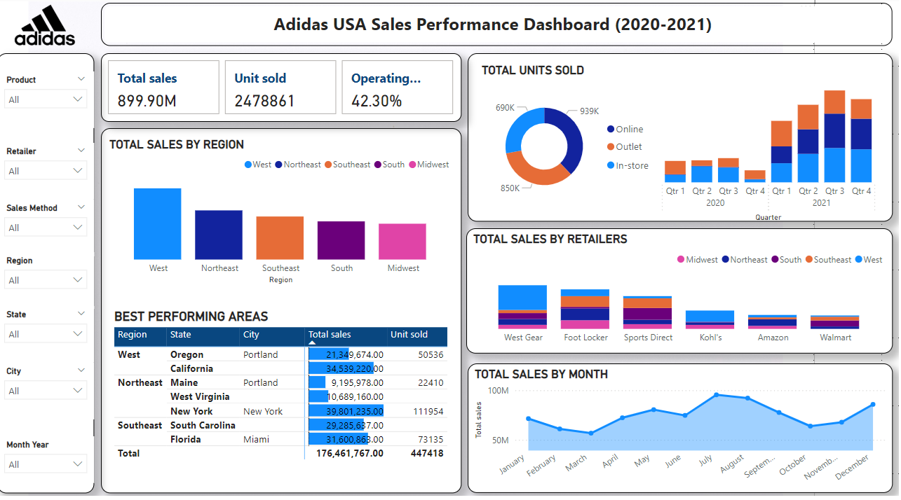
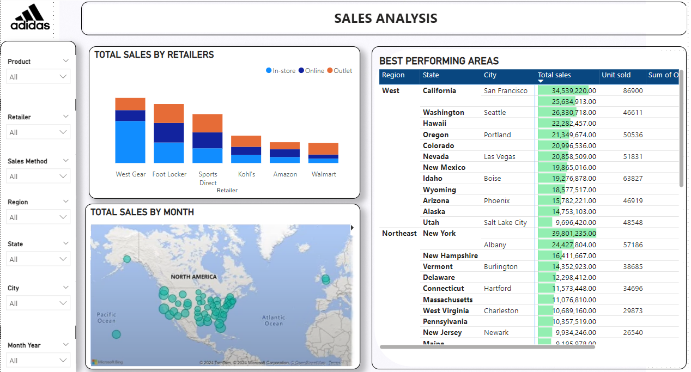
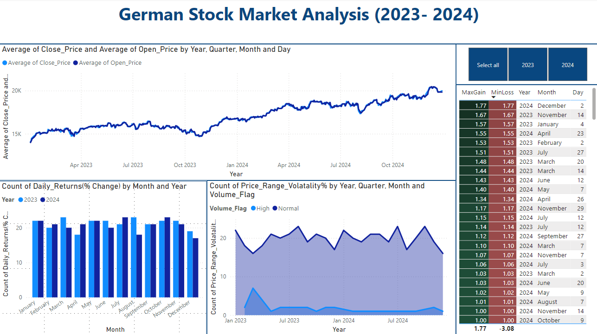
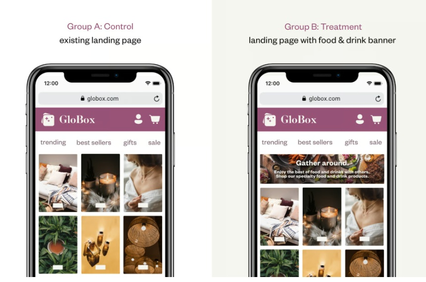

<!DOCTYPE html>
<html lang="en">
<head>
  <meta charset="UTF-8" />
  <meta name="viewport" content="width=device-width, initial-scale=1.0"/>
  <title>Project Portfolio</title>
  
</head>
<body>

  <!-- Header Section -->
  <header>
    <h1>Project Portfolio</h1>
    

      <!-- Replace this image source with your actual photo path -->

  

    <nav>
      <a href="#adidas">Adidas Dashboard</a>
      <a href="#stock">German Stock Analysis</a>
      <a href="#abtesting">A/B Testing Banner</a>
    </nav>
  </header>

  <!-- Main Content -->
  <main>

    <!-- Adidas Project -->
   <article id="adidas">
      <h2>Adidas USA Sales Performance Dashboard (2020-2021)</h2>
      

        <!-- Replace with your actual image paths -->
        
        
      

      <h3>Project Description</h3>
      

        This project analyzes sales performance data of Adidas in the USA for the years 2020-2021, focusing on key metrics such as total sales, units sold, and operating margins. Using Power BI dashboards, the project provides visualizations and insights into sales trends, performance by region, retailer, product, and sales method.
      

      <h3>Questions This Project Answers</h3>
      <ol>
        <li>Overall Sales Performance</li>
        <li>Sales by Region</li>
        <li>Best Performing Areas</li>
        <li>Retailer Performance</li>
        <li>Product Analysis</li>
        <li>Sales Trends Over Time</li>
        <li>Sales Method Analysis</li>
        <li>Geographic Distribution</li>
      </ol>
    </article>

    <!-- German Stock Market Analysis -->
   <article id="stock">
      <h2>German Stock Market Analysis (2023-2024)</h2>
      

        <!-- Replace with your actual image path -->
        
      

      <h3>Project Description</h3>
      

        This project involves the analysis of the German Stock Market (DAX index) data for the years 2023-2024. Using Power BI dashboards, the project visualizes key metrics such as average close and open prices, daily returns, price range volatility, and trends in trading volumes.
      

      <h3>Questions This Project Answers</h3>
      <ol>
        <li>Market Performance</li>
        <li>Volatility Analysis</li>
        <li>Daily Returns</li>
        <li>Volume Analysis</li>
        <li>Seasonality and Trends</li>
        <li>Key Performance Highlights</li>
      </ol>
    </article>

    <!-- A/B Testing Project -->
   <article id="abtesting">
      <h2>A/B Testing: Food &amp; Drink Banner</h2>
      

        <!-- Replace with your actual image path -->
        
      

      <h3>Project Overview</h3>
      

        This project evaluates whether displaying a food &amp; drink banner on the GloBox mobile website increases user conversions and revenue. Users are randomly assigned to either a control group (no banner) or a test group (banner displayed).
      

      

        For a detailed analysis including the SQL queries and statistical tests, please visit the project repository on GitHub.
      

      

        <a href="https://github.com/shubhammathur196/Projects/tree/e013037e40afa6c708db20d35be29b1eb6d06037/AB%20Testing"
           target="_blank"
           style="padding: 10px 20px; background: #007bff; color: #fff; text-decoration: none; border-radius: 5px;">
          View Project on GitHub
        </a>
      

    </article>

  </main>

  
</body>
</html>
